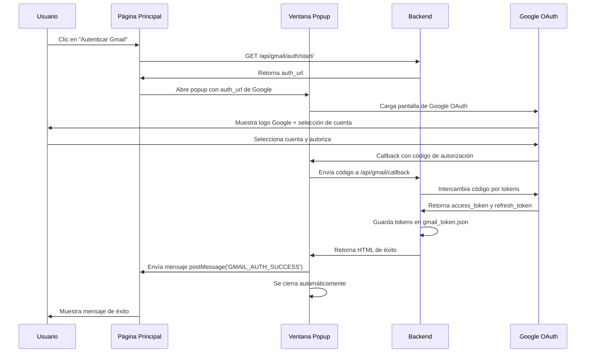

# 📧 Configuración de Gmail OAuth para SmartPharm ETL

## ✅ Sistema Implementado

Se ha implementado un flujo completo de autenticación OAuth 2.0 para Gmail que permite:
- Autenticación segura a través del navegador
- Acceso solo lectura a correos de Gmail
- Renovación automática de tokens
- Interfaz web para gestionar la autenticación

---

## 📋 PASO 1: Configurar Proyecto en Google Cloud Console

### 1.1. Crear Proyecto
1. Ve a [Google Cloud Console](https://console.cloud.google.com/)
2. Haz clic en el selector de proyectos (arriba a la izquierda)
3. Clic en "NUEVO PROYECTO"
4. Nombre del proyecto: **SmartPharm ETL**
5. Haz clic en "CREAR"

### 1.2. Habilitar Gmail API
1. En el menú lateral, ve a: **APIs y servicios** > **Biblioteca**
2. Busca: **Gmail API**
3. Haz clic en **Gmail API**
4. Haz clic en **HABILITAR**

### 1.3. Configurar Pantalla de Consentimiento OAuth
1. Ve a: **APIs y servicios** > **Pantalla de consentimiento de OAuth**
2. Selecciona: **Externo**
3. Haz clic en **CREAR**

#### Información de la aplicación:
- **Nombre de la aplicación**: SmartPharm ETL
- **Correo electrónico de asistencia**: (tu email)
- **Logotipo de la aplicación**: (opcional)
- **Dominio de la aplicación**: (dejar en blanco)
- **Correo electrónico del desarrollador**: (tu email)

4. Haz clic en **GUARDAR Y CONTINUAR**

#### Ámbitos (Scopes):
5. Haz clic en **AGREGAR O QUITAR ÁMBITOS**
6. Busca y selecciona:
   - `https://www.googleapis.com/auth/gmail.readonly`
7. Haz clic en **ACTUALIZAR**
8. Haz clic en **GUARDAR Y CONTINUAR**

#### Usuarios de prueba:
9. Haz clic en **AGREGAR USUARIOS**
10. Agrega el email de la cuenta de Gmail que usarás para el ETL
11. Haz clic en **AGREGAR**
12. Haz clic en **GUARDAR Y CONTINUAR**

### 1.4. Crear Credenciales OAuth 2.0
1. Ve a: **APIs y servicios** > **Credenciales**
2. Haz clic en: **+ CREAR CREDENCIALES** > **ID de cliente de OAuth**
3. Tipo de aplicación: **Aplicación web**
4. Nombre: **SmartPharm Web Client**

#### URIs de redirección autorizados:
5. Haz clic en **+ AGREGAR URI**
6. Agrega las siguientes URLs (una por línea):
   ```
   http://localhost:8000/api/gmail/callback
   http://127.0.0.1:8000/api/gmail/callback
   ```

   ⚠️ **IMPORTANTE**: Si despliegas en un servidor de producción, agrega también:
   ```
   https://tu-dominio.com/api/gmail/callback
   ```

7. Haz clic en **CREAR**

### 1.5. Descargar Credenciales
1. Verás un modal con **ID de cliente** y **Secret de cliente**
2. Haz clic en **DESCARGAR JSON**
3. Renombra el archivo descargado a: `gmail_credentials.json`
4. Coloca el archivo en:
   ```
   Backend_Django/gmail_credentials.json
   ```

---

## 📋 PASO 2: Verificar Configuración de Docker

El archivo `docker-compose.yml` ya está configurado. Solo verifica que incluya:

```yaml
backend:
  volumes:
    - ./Backend_Django:/app
```

Esto permite que el archivo `gmail_credentials.json` sea accesible dentro del contenedor.

---

## 🚀 PASO 3: Cómo Autenticar Gmail

### 3.1. Acceder a la Página ETL
1. Abre tu navegador
2. Ve a: **http://localhost/etl**

### 3.2. Autenticar Gmail
1. Verás una sección **"Autenticación de Gmail"**
2. Si Gmail no está autenticado, verás:
   - ⚠️ **Gmail no autenticado**
   - Un botón rojo: **"Autenticar Gmail"**

3. Haz clic en el botón **"Autenticar Gmail"**

4. **Se abrirá una ventana emergente (popup)** mostrando la pantalla de autenticación REAL de Google:
   - Logo de Google
   - Selección de cuenta
   - Permisos solicitados

   ⚠️ **Importante**: Asegúrate de permitir ventanas emergentes en tu navegador

5. En la ventana popup:
   - Selecciona tu cuenta de Gmail
   - Lee los permisos solicitados (solo lectura de Gmail)
   - Haz clic en **"Permitir"**

6. Después de autorizar:
   - La ventana popup mostrará ✅ **"¡Autenticación Exitosa!"**
   - Se cerrará automáticamente en 1.5 segundos
   - La página principal mostrará: ✅ **Gmail autenticado correctamente**

### 3.3. Ejecutar el ETL
Una vez autenticado Gmail:
1. El botón **"🚀 Ejecutar ETL y Actualizar Precios"** estará habilitado
2. Haz clic en el botón para iniciar el proceso ETL
3. El sistema:
   - Leerá correos de Gmail (últimos 3 días)
   - Descargará adjuntos Excel/PDF
   - Extraerá ofertas de laboratorios
   - Actualizará precios en la base de datos

---

## 🔄 Flujo de Autenticación OAuth con Popup

El sistema utiliza una **ventana emergente (popup)** para mostrar la autenticación REAL de Google:



### Ventajas del Popup

✅ **Pantalla de Google Real**: Muestra el logo de Google y la interfaz oficial de OAuth
✅ **No redirige la página**: La página principal permanece abierta
✅ **Cierre automático**: El popup se cierra solo después de autorizar
✅ **Comunicación segura**: Usa `postMessage` para notificar a la página principal
✅ **Mejor UX**: El usuario no pierde el contexto de la aplicación

---

## 🔐 Seguridad y Tokens

### Ubicación de Archivos
- **Credenciales**: `Backend_Django/gmail_credentials.json` (configuración inicial)
- **Tokens**: `Backend_Django/gmail_token.json` (generado después de autorizar)

### Renovación Automática
El sistema renovará automáticamente el token cuando expire usando el `refresh_token`.

### Revocar Acceso
Para revocar el acceso a Gmail:
1. Método 1: Elimina el archivo `Backend_Django/gmail_token.json`
2. Método 2: Ve a [Permisos de cuenta de Google](https://myaccount.google.com/permissions) y revoca acceso a "SmartPharm ETL"

---

## 🛠️ Troubleshooting

### Error: "No se encontró gmail_credentials.json"
**Solución**: Asegúrate de haber descargado y colocado el archivo `gmail_credentials.json` en `Backend_Django/`

### Error: "redirect_uri_mismatch"
**Solución**:
1. Ve a Google Cloud Console > Credenciales
2. Edita el cliente OAuth
3. Verifica que las URIs de redirección incluyan: `http://localhost:8000/api/gmail/callback`

### Error: "access_denied"
**Solución**: El usuario canceló la autorización. Intenta nuevamente haciendo clic en "Autenticar Gmail"

### El botón "Ejecutar ETL" está deshabilitado
**Solución**: Primero debes autenticar Gmail. Verifica que el panel de "Autenticación de Gmail" muestre ✅ **Gmail autenticado correctamente**

---

## 📝 Endpoints de API

### Verificar Estado de Autenticación
```bash
GET /api/gmail/auth/status/
```

Respuesta:
```json
{
  "authenticated": true,
  "message": "Gmail autenticado correctamente"
}
```

### Iniciar Autenticación
```bash
GET /api/gmail/auth/start/
```

Respuesta:
```json
{
  "success": true,
  "auth_url": "https://accounts.google.com/o/oauth2/auth?..."
}
```

### Revocar Autenticación
```bash
DELETE /api/gmail/auth/revoke/
```

Respuesta:
```json
{
  "success": true,
  "message": "Autenticación de Gmail revocada"
}
```

---

## ✨ Características Implementadas

- ✅ Autenticación OAuth 2.0 web (no requiere consola)
- ✅ Renovación automática de tokens
- ✅ Interfaz visual para gestionar autenticación
- ✅ Validación de estado antes de ejecutar ETL
- ✅ Manejo de errores de autenticación
- ✅ Redirección automática después de autorizar
- ✅ Mensajes de éxito/error en la UI

---

## 🎯 Próximos Pasos

1. **Configurar Gmail credentials** siguiendo el PASO 1
2. **Autenticar Gmail** desde la página ETL (PASO 3)
3. **Ejecutar el ETL** y verificar que funcione correctamente
4. **Configurar Celery Beat** para ejecución automática periódica

---

## 📚 Referencias

- [Gmail API Documentation](https://developers.google.com/gmail/api)
- [OAuth 2.0 Web Server Flow](https://developers.google.com/identity/protocols/oauth2/web-server)
- [Google Cloud Console](https://console.cloud.google.com/)
